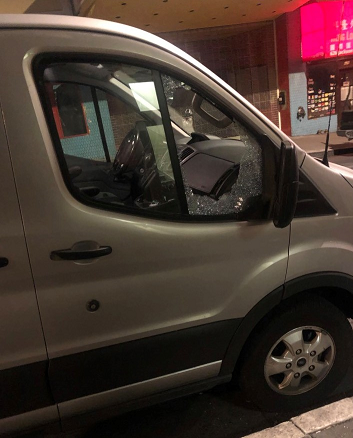
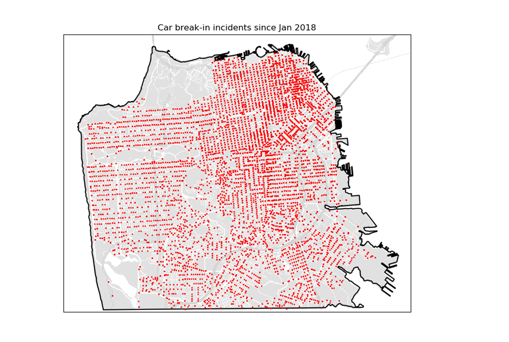
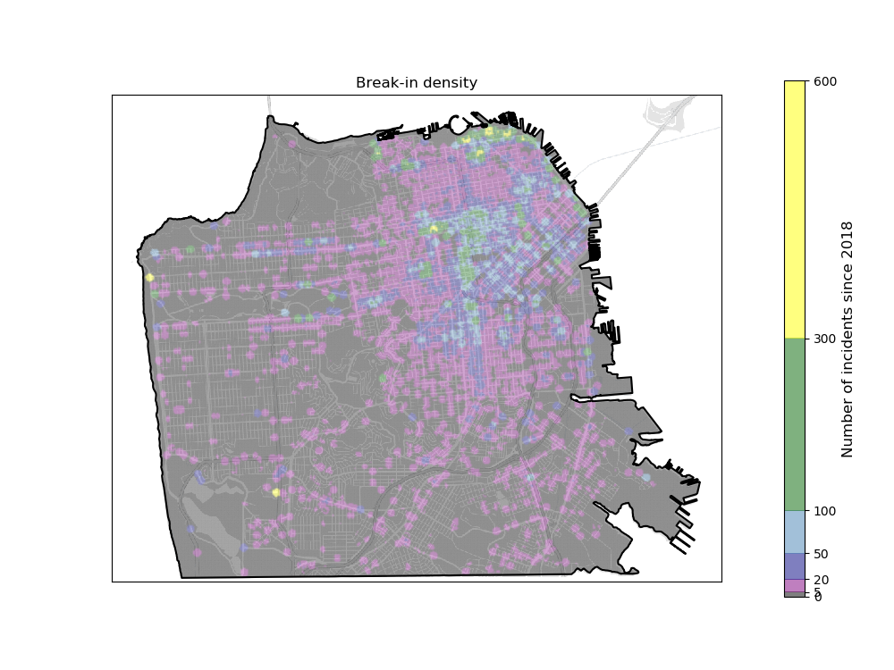
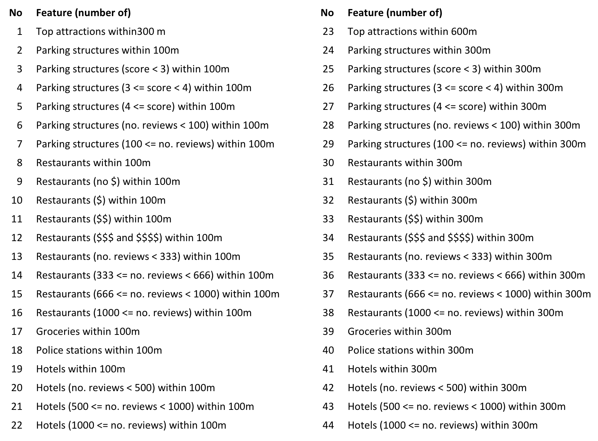
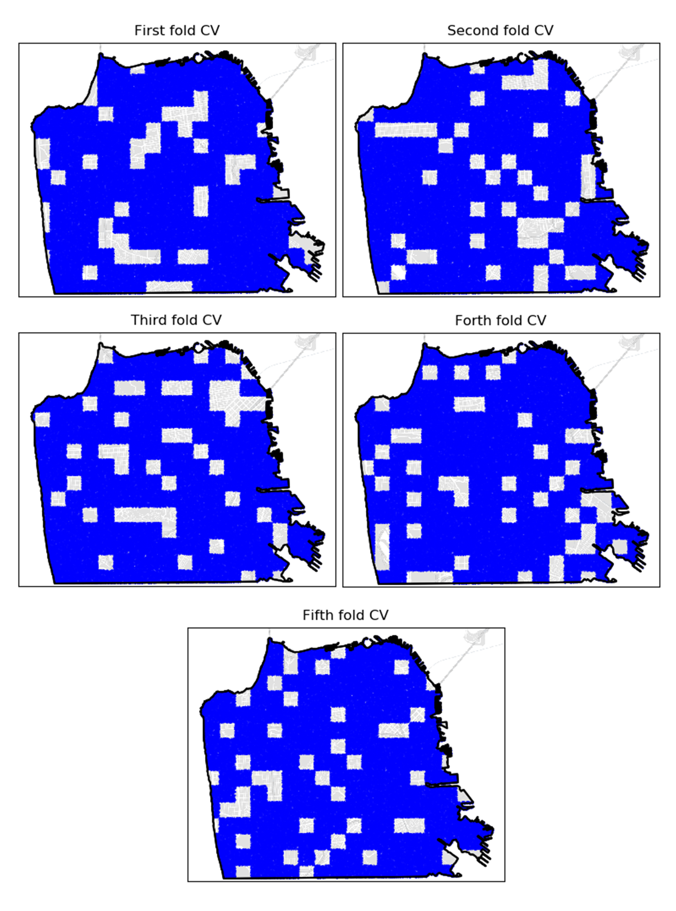
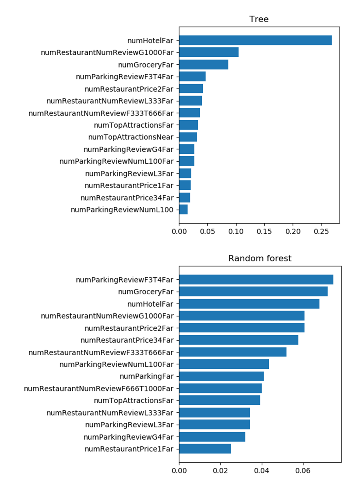
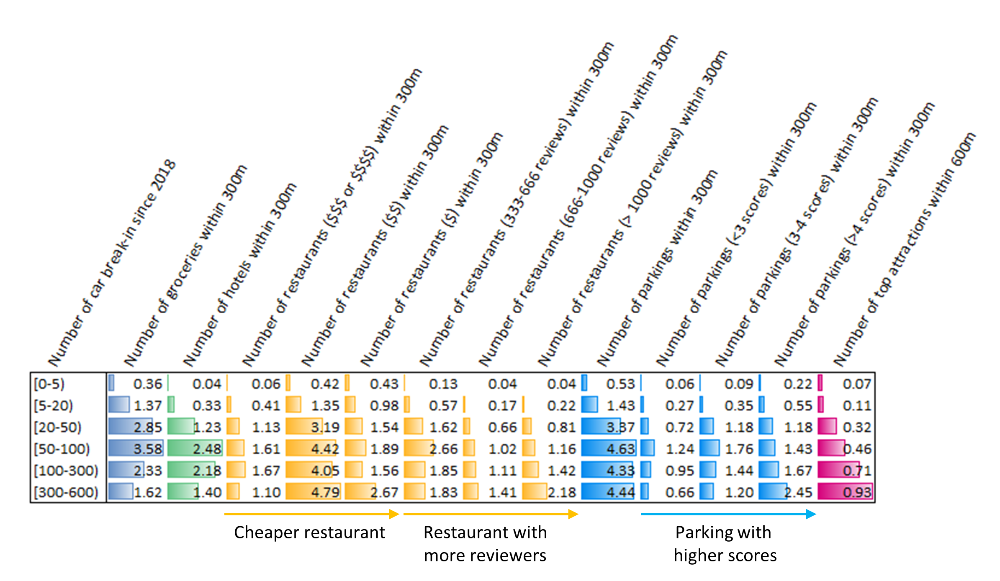

# Applying machine learning to car burglaries in San Francisco: Revealing the connections between neighborhoods and car burglary intensity

### Hilights
- Achieve 80% city-wide accuracy of identifying the intensity of car burglary using tree and random forest models.
- Provide the insights between car burglary intensity and neighborhood characteristics such as numbers of top attractions, parking structures, restaurants, and hotels.
- Exclude all features that directly discriminate income and demographic.

Car burglary or vehicle break-in is the most common crime in San Francisco with the average of 71 reported incidents per day\[[1](https://projects.sfchronicle.com/trackers/sf-car-breakins/)\]. Even though car burglary usually does not lead to assault and battery, it severely causes panic in a day-to-day life of residents, merchants, and tourists in the city. This persistent car burglary problem continues to erode city’s economy in addition to the loss of personal properties.

Understanding what control the intensity of car burglary in San Francisco is the first step for law enforcement and city planning units to alleviate the problem. It also helps insurance companies, business owners, and residents to access the risk of car burglary in each locality. So far, the locations of high intensity are visually identified as tourist attractions such as pier 39, palace of fine art, and painted ladies.\[[2](https://www.spotangels.com/blog/sf-parking-car-break-ins/),[3](https://projects.sfchronicle.com/2018/sf-car-breakins/)\] However, car burglary is a city-wide problem with various levels of intensity. There should be more connections between the intensity levels and the characteristic of the neighborhood such as numbers of parking structures, restaurants, hotels, groceries, and police stations.

The goal of this project is to reveal the connections between neighborhood characteristics and car burglary intensity using several machine learning models such as tree, random forest, and gradient boosting. The fitted models are also provided as a tool for predicting the intensity level.

## Dataset

### Reported car burglary
The data of reported car burglary was queried from the SFPD incident reports website\[[4](https://data.sfgov.org/Public-Safety/Police-Department-Incident-Reports-Historical-2003/tmnf-yvry/data)\]. This project focuses on the reported incidents from Jan 2018 to Aug 2019, comprising 39,925 incidents. The reported incidents contain latitude and longitude coordinates, which were converted to UTM coordinates using the pyproj package\[[5](https://pypi.org/project/pyproj/)\].

In this project, the intensity of car burglary was defined by the number of incidents within 100-meter radius for each location point. The picture below shows the intensity of car burglary as a density map ranging from 0 to 600 incidents. The intensity was classified into 6 levels as shown in the table below.

| Category | Level | Number of incidents within 100 m | Areal fraction (%) |
|----------|-------|----------------------------------|--------------------|
| 1 | Almost none | [0, 5) | 66.44 |
| 2 | Mild | [5, 20) | 21.73 |
| 3 | Moderate | [20, 50) | 6.97 |
| 4 | High | [50, 100) | 2.8 |
| 5 | Very high | [100, 300) | 1.91 |
| 6 | Extremely high | [300, 600) | 0.16 |

### Neighborhood characteristic

The neighborhood characteristic is defined by the numbers of top attractions, parking structures, restaurants, hotels, groceries, and police stations around each location point. The list of top 20 tourist attractions come from planetware website\[[6](https://www.planetware.com/tourist-attractions-/san-francisco-us-ca-sf.htm)\]. Note that this project excludes the Presidio area. The addresses and reviewing information of 691 parking structures, 1430 restaurants, 454 groceries, 182 hotels, and 26 police stations were gathered from Google map website. The addresses of these places were converted to UTM coordinates using geopy\[[7](https://geopy.readthedocs.io/en/stable/)\] and pyproj packages.

The locations of these places are shown together with the intensity of car burglary in the picture below. As suggested by many previous studies, neighborhood nearby the top attractions have very high (green) or extremely high (yellow) levels of car burglary. However, not all of extremely high intensity area has top attraction nearby. Parking structures and hotels are tightly located in the tourist attractions, downtown, and the Lombard St. Restaurant locations are similar to parking structures and hotels except they also tightly distributed along main streets outside down town area. The locations of groceries are roughly spread out through the city.

In addition to locations, the reviewing information (score, number of reviewers, and price) of those places may have connection to the intensity of car burglary. The example is the number of reviewers of restaurants as shown in the picture below. The higher number of reviewers is associated with the downtown and tourist attraction areas, which have high to extremely high car burglary intensity.

## Model setup and training

### Model setup

This project applied four machine learning models (linear regressor\[[8](https://scikit-learn.org/stable/modules/generated/sklearn.linear_model.LinearRegression.html)\], tree regressor\[[9](https://scikit-learn.org/stable/modules/generated/sklearn.tree.DecisionTreeRegressor.html)\], random forest regressor\[[10](https://scikit-learn.org/stable/modules/generated/sklearn.ensemble.RandomForestRegressor.html)\], and gradient boosting regressor\[[11](https://scikit-learn.org/stable/modules/generated/sklearn.ensemble.GradientBoostingRegressor.html)\]) to reveal the connections between neighborhood characteristics and car burglary intensity. Note that the linear regressor serves as a baseline comparison to the other three models. For all models, the outcome (Y) is the levels or ordinal classes of car burglary intensity (from 1 to 6). The features (X) are the number of previously mentioned places with their reviews information within near and far distances as summarizedin the table below.Note that the features that directly discriminate income and demographic are intentionally excluded in this project.

### Model training

The training of all models use the same training data points. The training data consists of 100,000 locations randomly chosen within the outline of San Francisco.\[[12](https://data.sfgov.org/Geographic-Locations-and-Boundaries/Outline-of-San-Francisco-Mask-/6tcm-n6t4)\] Each location of training data has the features (X) and outcome (Y) as described in the previous section.

The training of the linear regressor (a baseline model) is straight forward with the total 100,000 training data points. The training of tree, random forest, and gradient boosting models employed cross validation (CV) to fine-tune the parameters and prevent over-fitting. The five-fold CV was performed in a grid-based fashion to avoid overlapping neighborhood as shown in the figure below.The selection of which grid to be hold out in which fold is random.

The table below summarizes the tuning and other parameters of each model. Max depth is a common turning parameter among the three models. The mean train and test CV errors of each model as a function of max depth are shown in the figure below. As expected, the train CV error monotonically decreases with higher max depth. The optimal max depth for each model was determined by lowest test CV error. The optimal max depth for gradient boosting is lower than that of random forest, which is in turn lower than that of a single tree. The train and test CV errors of the three models are highly similar suggesting that the main source of fitting error comes from bias more than variance.

| Model | Tuning parameters via CV | Other parameters |
|-------|--------------------------|------------------|
| Tree | max depth = 30| |
| Random forest | max depth = 21 | max features = sqrt, number of trees = 50 |
| Gradient boosting | learning rate= 1, boosting stage = 70, max depth= 6 | max features = sqrt, subsample = 0.8 |

### Model fitting results
The figure below displays the results of fitted linear, tree, random forest, and gradient boosting models.The fitting result of a linear model is crude as for a baseline purpose. However, the fitted tree, random forest, and gradient boosting models are able to capture almost all patterns of car burglary in the city. The models correctly identify the areas of high (blue), very high (green), and extremely high (yellow) levels of intensity. They also reach 80% city-wide accuracy. The main fitting error comes from separating almost none (black) and mild (purple) levels in the residential areas in the west side of the city. Note that gradient boosting model is less stable than tree and random forest models causing slightly lower accuracy.

### Insights from the fitted models
The picture below shows the list of 15 features that have the highest feature importance in tree and random forest models, which have the highest fitting accuracy. The feature importance measures the effectiveness in reducing fitting error of a particular feature. There are three main observations from this figure. First, almost all of the top 15 features in each model are far-distance features that describes the numbers of interested places within 300-meter radius, compared to 100-meter radius of the near-distance features andthe density of car burglary. This implies that car burglary intensity at each location is best explained with the neighborhood within 300m, rather than 100m. Second, there are 14 common features between the top 15 features of the tree and random forest, indicating the low variance error in the fitting. Third, the distribution of feature importance values is more uniform in the random forest, compared to tree as expected.

Comparing the average values of the top 15 features in each intensity level offers a qualitative interpretation of the fitted model, as shown in the table below. The table also contains a bar graph for each column and color coded with the type of buildings for a purpose of visualization. Here is the list of interpretations from this table.

- The almost none (0-5) level of car burglary is associated with very low numbers of groceries, hotels, restaurants, parking structures, and top attractions. This is a characteristic of residential area.
- The small increases in the number of above places leads to the mild (5-20) level of car burglary. This is the characteristic of the main streets in residential area or the dense residential area.
- The moderate (20-50) level of car burglary has a significant increase in the numbers of groceries, hotels, restaurants, parking structures, and top attractions. This is a characteristic of the edge of busy commercial area.
- The high (50-100) level of car burglary has the highest numbers of groceries, hotels, and parking structures. This is a characteristic of the busy commercial area.
- The very high (100-300) level of car burglary has increasing numbers of tourist attractions and restaurants with higher number of reviewers. This is a characteristic of the busy commercial area and around tourist attractions.
- The extremely high (300-600) level of car burglary has highest numbers of top attractions and restaurants with one $ or the highest number of reviewers. This is a characteristic of the parking right on top attractions and big shopping centers.

One counter-intuitive finding is that parking structures with higher reviewing scores has higher number of car burglary. It is possible that the parking structures with higher scored have more parked car inside resulting in higher number of incidents.

## Summary

This project reveals the connection between the intensity levels of car burglary and neighborhood characteristic such as the numbers of parking structures, restaurants, hotels, groceries, and police stations. This project also achieves 80% city-wide accuracy in classifying the intensity levels using tree and random forest models.

## Author

* **Krongrath Suwannasri** - *Ph.D. candidate at Stanford University*

## License

This project is licensed under the MIT License - see the [LICENSE.md](LICENSE.md) file for details

## Acknowledgments

I would like to thanks Jerome H. Friedman, Tee Ponsukcharoen, and Navi Tansaraviput for feedbacks on this project.
